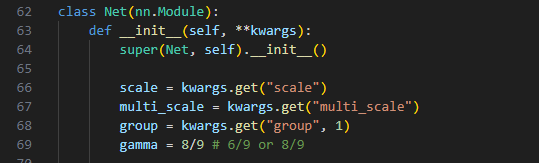

# Partial Filter Sharing: Improved Parameter-sharing Methods for Single Image Super-Resolution Networks


### CARN-PS / DRRN-PS Repository
Our code is built on [CARN-pytorch](https://github.com/nmhkahn/CARN-pytorch/tree/master).
If you encounter any problems using the code, please refer to [CARN Issue Threads](https://github.com/nmhkahn/CARN-pytorch/issues) first.

### Environments
- Python 3.7.13
- PyTorch (1.13.1), torchvision
- Numpy, Scipy
- Pillow, Scikit-image
- h5py
- importlib
- einops

### Testset Preparation (By CARN authors)
Benchmark datasets can be downloaded in [Google Drive](https://drive.google.com/file/d/1Pa3WM9vJlRmBHV9-VlcY-2j20w7CeH_N/view?usp=sharing). Please put all the datasets in `dataset` directory.

### Test & Evaluation
We provide the pretrained models in `checkpoint` directory.
To test CARN-PS on benchmark dataset, first check the gamma on line 69 of `./carn/model/carn_ps.py` <br/>

 <br/>

then, run test code as follows:
```shell
$ python carn/sample.py --model carn_ps \
                        --test_data_dir dataset/<dataset> \
                        --scale [2|3|4] \
                        --ckpt_path ./checkpoint/carnps8_9.pth \
                        --sample_dir <sample_dir>
```
For DRRN-PS, run test code as follows:
```shell
$ python carn/sample.py --model drrn_ps \
                        --test_data_dir dataset/<dataset> \
                        --scale [2|3|4] \
                        --ckpt_path ./checkpoint/drrnps.pth \
                        --sample_dir <sample_dir>
```
For evaluation, use the attached `PSNR_SSIM_Test.m` matlab file.

### Acknowledgements

- We would like to express our thanks to the authors of the [CARN-pytorch](https://github.com/nmhkahn/CARN-pytorch/tree/master) for generously releasing their code to the public.


